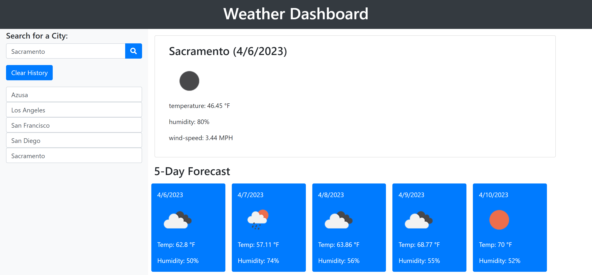

# weather-dashboard

## Description
Weather Dashboard was created using Bootstrap, JavaScript and API calls. Using the 5 Day Weather Forecast website to get an API key to gather information for a current five-day weather in any city. Within the dashboard, there is information such as the current temperature, wind-speed, humidity and along with a weather icon. Local storage was used in JavaScript to save the city names that the user enters. A "clear search" button also exist to clear all the city names that the user had entered.

## Screenshot of Weather Dashboard

## Link to Weather Dashboard

https://jovaldez98.github.io/weather-dashboard/

## Credits
- David Park (Tutor)
- Class activities